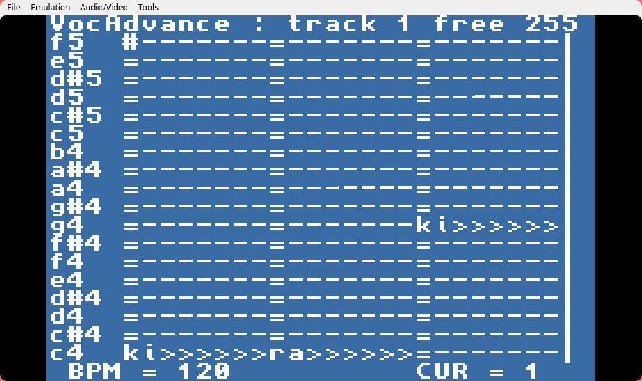

# VocAdvance
VOCALOID-like software for GBA

> Note at the top of the README: if you just wanna build this, don't `git clone`!! Download the .zip file from GitHub. It's way faster!

This program for the GameBoy Advance allows you to create vocal songs with a preset voicebank (provided ones are generated with espeak and the script in `generator/`). It's pretty basic, but does support:

- Different BPMs
- Muiltiple tracks (4 by default)

> Note: this doesn't synthesize anything at runtime, it merely plays back voice clips with a bit of fade in and fade out. No magic here!

## Downloading

Head over to the releases tab and download the latest release.

## Compiling

Install [devkitPro](https://devkitpro.org/wiki/devkitPro_pacman), then install the `gba-dev` package, after that run `make`. Simple as that!